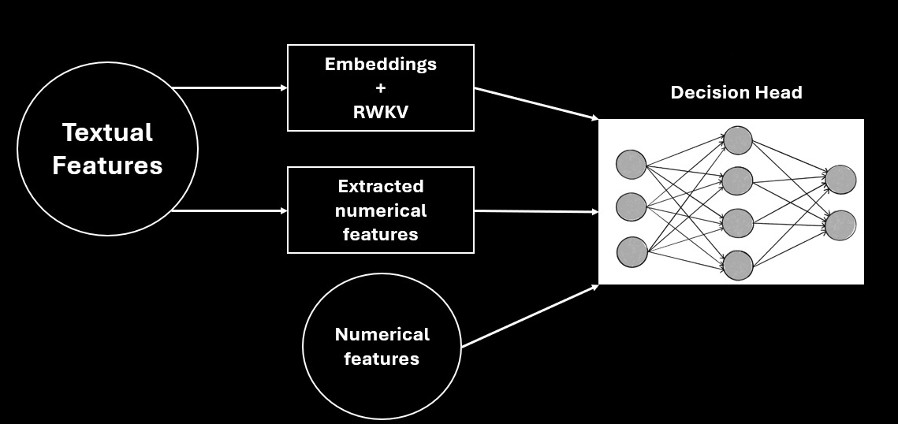
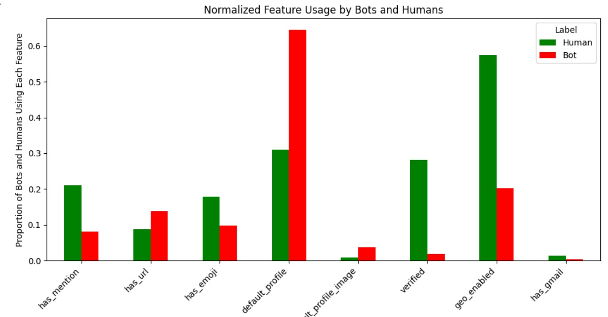

# Bot-Ani? RWKV Twitter Bot Detection Project
Detecting whether users are plants since 2024
<p align="center">
  
</p>

"Bot-Ani?" is a project aimed at developing a machine learning model for detecting bot accounts on Twitter using the RWKV model, a relatively new architecture that combines the strengths of Recurrent Neural Networks (RNNs) and Transformers. The project involves data collection, preprocessing, feature extraction, model tuning, and evaluation to effectively distinguish between human-operated and bot-operated Twitter profiles.  

## Why is Bot Classification Improtant?
  
Twitter (x.com) is a social media platform in which people can manage a profile, follow and be followed others, and
post texts and images. An estimated 15% of all twitter users are bots - automated accounts. While some are harmless,
others spread fake news on social media, influence the outcome of elections, and propagate conspiracy theories and
harmful ideologies. [2]. We care deeply about the task of bot detection, however due to the size of Twitter and the
elusiveness of several bots, bot moderation must be at least partially automated. 

## Architecture 
We tuned the RWKV architecture and fitted it with a decision head, the hidden-layer embeddings of the model are extracted and concatenated with dimension transformed numerical features (both the ones included in the dataset, and ones we scraped ourselved). These get inputed to a small neural network that provides us with classification probabilities. 
<p align="center">
  
</p>
Our model in code:  

```python
class RWKVForClassification(nn.Module):
    def __init__(self, model, num_labels, num_features):
        super(RWKVForClassification, self).__init__()
        self.model = model

        # Linear layer for numerical features, transforms their dimensions to the size of the hidden state for later concatenation
        self.feature_layer = nn.Linear(num_features, self.model.config.hidden_size)

        # Classification head
        self.classifier = ClassificationHead(self.model.config.hidden_size * 2, num_labels) #a linear layer that takes in the hidden state as well as the concatenated features, and outputs a probability.

    def forward(self, input_ids, attention_mask=None, features=None):
        # Forward pass through the RWKV model for text inputs
        outputs = self.model(input_ids=input_ids, attention_mask=attention_mask)
        cls_output = outputs.last_hidden_state[:, 0, :].clone()  # Make a copy to avoid in-place operation

        # Forward pass for numerical features
        feature_output = self.feature_layer(features)

        # Concatenate the outputs from the text model and numerical features
        combined_output = torch.cat((cls_output, feature_output), dim=1)

        # Pass through the classification head
        logits = self.classifier(combined_output)
        return logits
```
where the classification head is a simple neural network defined as:  
```python
class ClassificationHead(nn.Module):
    def __init__(self, hidden_size, num_labels):
        super(ClassificationHead, self).__init__()
        self.dense = nn.Linear(hidden_size, hidden_size)
        self.dropout = nn.Dropout(0.1)
        self.out_proj = nn.Linear(hidden_size, num_labels)

    def forward(self, x):
        x = self.dropout(x)
        x = self.dense(x)
        x = torch.relu(x)
        x = self.dropout(x)
        x = self.out_proj(x)
        return x
```


## Files
- DL report contains an ethic statement, as well as a final report with an architecture description, experimentation and more.
- preprocessing_twitter_bot.ipynb for preprocessing and feature extraction, as well as importing the data into a parquet file.
- Preprocessed_dataset.parquet is the preprocessed dataset file.
- {NEED TO COMPLETE ONCE THE FINAL RUN'S DONE} 

## Dataset
The dataset we chose to work with is the huggingface AIRT-ML, “Twitter human bots dataset.” [3]. We chose it due to its size (not too big) and that it lets us perform feature extraction, which could prove very helpful. Looking at the objects at our dataset and their extracted textual features, we can see that there certainly are differences between bots and humans that can be used for the classification task.
<p align="center">
  
</p>

## Results 
- {NEED TO COMPLETE ONCE THE FINAL RUN'S DONE}

## References
[1] Follower-Audit, twitter-gear image https://www.followeraudit.com/blog/how-to-spot-twitter-bots/

[2] E. Ferrara, “Disinformation and social bot operations in the run up to the 2017 french presidential election,” First
Monday, July 2017.

[3] AIRT-ML, “Twitter human bots dataset.” https://huggingface.co/datasets/airt-ml/twitter-human-bots,
2023. Accessed: 2024-08-13.

